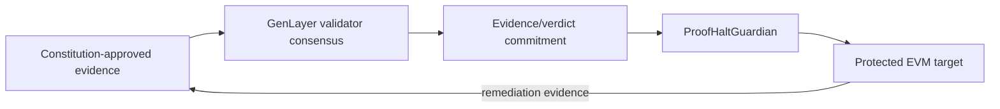

# ProofHalt

**Consensus before intervention. Proof before recovery.**

ProofHalt is an evidence-bound emergency governor for autonomous protocols. GenLayer validators independently inspect constitution-approved evidence, reach consensus on a narrow HALT or RESTORE decision, and bind the result to the exact incident, revision, evidence set and enforcement action.

[Live demo](https://proofhalt.netlify.app) · [GenLayer contract](https://explorer-studio.genlayer.com/address/0x02E5Ac4D8E718e15EdF6c52C48908d45a1A628bB) · [Deployment transaction](https://explorer-studio.genlayer.com/tx/0xea7579b31f5461adccfc83065a166097b88b2e002b88f032d5c3feb2c42dc68c) · [Public incident record](docs/STUDIONET_PUBLIC_RECORD.md)

## What makes ProofHalt different

- **No reporter-selected source policy.** Protocol evidence rules are frozen in a versioned constitution.
- **Independent validator retrieval.** Evidence is fetched inside GenLayer nondeterministic execution and validators independently reassess it.
- **Source-bound, hash-bound evidence.** Adjudicated bytes must come from the constitution-approved URL itself or a contract-verified GitHub raw artifact at the same exact commit/path; claimant-selected mirrors are rejected.
- **Source-independence checks.** Mirrors of one origin cannot manufacture quorum.
- **Fail-closed recovery.** RESTORE needs a later remediation decision, independent remediation evidence and target-side patch confirmation.
- **Minimal EVM authority.** The Guardian can only pause/restore the bound target for a bound incident revision; it exposes no arbitrary-call surface.
- **Overlap-safe incidents.** Restoring one incident cannot unpause a target while another incident is still active.

## Architecture



| Layer | Responsibility |
|---|---|
| `contracts/proofhalt.py` | Constitution registry, evidence intake, consensus adjudication, append-only revisions, HALT/RESTORE authorization |
| `contracts/ProofHaltGuardian.sol` | Minimal incident/revision-scoped enforcement bridge |
| `contracts/DemoVault.sol` | Testnet-only protected target with a bounded demo exploit and one-way patch |
| `site/` | Wallet-enabled reviewer console for live reads and every contract lifecycle action, including target-state confirmation and incident closure |

## Verification

The recovered release bundle is reproducible from this repository:

- Python/state-machine/model suites: **64/64 PASS**
- Stage-9 static cross-layer audit snapshot: **36/36 PASS**
- Additional repository security invariants: **62/62 PASS**
- Static website release checks: **44/44 PASS**
- Solidity compiler gate: configured for exact `solc 0.8.36` and run in GitHub Actions

The browser SDK is pinned to `genlayer-js` 1.1.8 and bundled locally during the build. The live constitution and public incident reads require no wallet. MetaMask requests account access and a switch/add to Studionet; writes occur only after the user clicks a named action and confirms the zero-value contract call in MetaMask. ProofHalt requests no token approval, arbitrary signature or Snap installation.

Run the local gate:

```bash
npm ci
npm test
```

Successful completion ends with:

```text
PROOFHALT_RELEASE_GATE_PASS
```

## Public release

| Field | Value |
|---|---|
| GenLayer network | Studionet / Studio explorer |
| ProofHalt Intelligent Contract | `0x02E5Ac4D8E718e15EdF6c52C48908d45a1A628bB` |
| Deploy transaction | `0xea7579b31f5461adccfc83065a166097b88b2e002b88f032d5c3feb2c42dc68c` |
| Public protocol / incident | `proofhalt-studionet-demo` / `PH-000001` |
| Latest verdict | `INSUFFICIENT_EVIDENCE` / no action (fail-closed) |
| Website | `https://proofhalt.netlify.app` |
| Netlify production site | `proofhalt` (`e6791f4a-0842-4e5c-905a-a39e53de9261`) |
| Netlify production URL | `https://proofhalt.netlify.app` |

The public case preserves real registration, activation, incident, four evidence writes and two consensus verdict revisions. Studionet validators could not retrieve the web evidence, so ProofHalt correctly refused HALT authority; remediation/restore were therefore not valid transitions. The Solidity Guardian and DemoVault remain compiled and lifecycle-tested locally/model-side. This repository does **not** claim a funded public Bradbury/EVM deployment for them.

## Repository map

```text
contracts/   GenLayer intelligent contract + Solidity Guardian/Vault
compiler/    pinned solc standard-json compiler gate
tests/       behavioral, overlap, Guardian/Vault and demo lifecycle tests
tools/       evidence helpers + security/site release checks
site/        static Netlify demo source
docs/        architecture, security, deployment and submission notes
results/     preserved Stage-9 audit/test evidence
```

Start with `docs/ARCHITECTURE.md`, `docs/SECURITY.md`, and `docs/DEPLOYMENT.md`.
The latest steward-request mapping and focused regression evidence are in [`docs/STEWARD_RESPONSE_V1_2.md`](docs/STEWARD_RESPONSE_V1_2.md).

> **Testnet-only warning:** `DemoVault.sol` deliberately contains a bounded exploit path so reviewers can see the halt/remediate/restore lifecycle. Never deploy it with valuable assets.

## License

MIT
