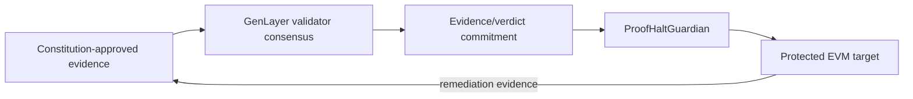

# ProofHalt

**Consensus before intervention. Proof before recovery.**

ProofHalt is an evidence-bound emergency governor for autonomous protocols. GenLayer validators independently inspect constitution-approved evidence, reach consensus on a narrow HALT or RESTORE decision, and bind the result to the exact incident, revision, evidence set and enforcement action.

[Live demo](https://proofhalt.netlify.app) · [GenLayer contract](https://explorer-studio.genlayer.com/address/0x9E43C93Dae87C32eEadbD8E733FAb4e54cF06767) · [Deployment transaction](https://explorer-studio.genlayer.com/tx/0x1e4d126a9f8880f259a7e6eb983b7a949110d7e18631b691f0abf9e54fee53d7)

## What makes ProofHalt different

- **No reporter-selected source policy.** Protocol evidence rules are frozen in a versioned constitution.
- **Independent validator retrieval.** Evidence is fetched inside GenLayer nondeterministic execution and validators independently reassess it.
- **Hash-bound evidence.** Changed page contents cannot silently replace the submitted evidence artifact.
- **Source-independence checks.** Mirrors of one origin cannot manufacture quorum.
- **Fail-closed recovery.** RESTORE needs a later remediation decision, independent remediation evidence and target-side patch confirmation.
- **Minimal EVM authority.** The Guardian can only pause/restore the bound target for a bound incident revision; it exposes no arbitrary-call surface.
- **Overlap-safe incidents.** Restoring one incident cannot unpause a target while another incident is still active.

## Architecture



| Layer | Responsibility |
|---|---|
| `contracts/proofhalt.py` | Constitution registry, evidence intake, consensus adjudication, append-only revisions, HALT/RESTORE authorization |
| `contracts/ProofHaltGuardian.sol` | Minimal incident/revision-scoped enforcement bridge |
| `contracts/DemoVault.sol` | Testnet-only protected target with a bounded demo exploit and one-way patch |
| `site/` | Reviewer-facing incident-room demo and release manifest |

## Verification

The recovered release bundle is reproducible from this repository:

- Python/state-machine/model suites: **60/60 PASS**
- Stage-9 static cross-layer audit snapshot: **36/36 PASS**
- Additional repository security invariants: **50/50 PASS**
- Static website release checks: **18/18 PASS**
- Solidity compiler gate: configured for exact `solc 0.8.36` and run in GitHub Actions

Run the local gate:

```bash
./RUN_ALL_OFFLINE_CHECKS.sh
```

Successful completion ends with:

```text
PROOFHALT_RELEASE_GATE_PASS
```

## Public release

| Field | Value |
|---|---|
| GenLayer network | Studionet / Studio explorer |
| ProofHalt Intelligent Contract | `0x9E43C93Dae87C32eEadbD8E733FAb4e54cF06767` |
| Deploy transaction | `0x1e4d126a9f8880f259a7e6eb983b7a949110d7e18631b691f0abf9e54fee53d7` |
| Website | `https://proofhalt.netlify.app` |
| Netlify production deploy | `6aa7d58fed7f8c1af2d0487c` |
| Netlify deploy state | `ready` |

The Solidity Guardian and DemoVault are included, compiled/audited through the release pipeline, and lifecycle-tested locally/model-side. This repository does **not** claim a funded public Bradbury/EVM deployment for those two contracts.

## Repository map

```text
contracts/   GenLayer intelligent contract + Solidity Guardian/Vault
compiler/    pinned solc standard-json compiler gate
tests/       behavioral, overlap, Guardian/Vault and demo lifecycle tests
tools/       evidence helpers + security/site release checks
site/        static Netlify demo source
docs/        architecture, security, deployment and submission notes
results/     preserved Stage-9 audit/test evidence
```

Start with `docs/ARCHITECTURE.md`, `docs/SECURITY.md`, and `docs/DEPLOYMENT.md`.

> **Testnet-only warning:** `DemoVault.sol` deliberately contains a bounded exploit path so reviewers can see the halt/remediate/restore lifecycle. Never deploy it with valuable assets.

## License

MIT
