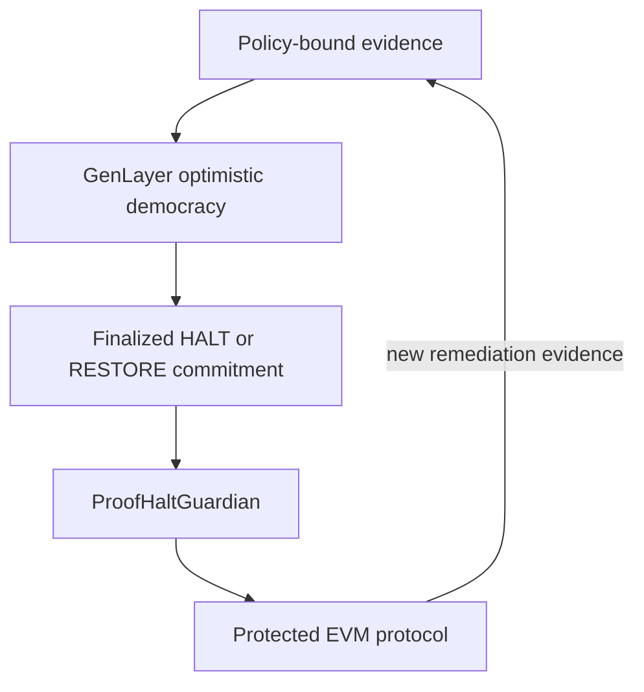

# ProofHalt

<p align="center">
  
</p>

<p align="center"><strong>Consensus before intervention. Proof before recovery.</strong></p>

ProofHalt is an evidence-bound emergency governor for autonomous protocols. GenLayer validators independently retrieve constitution-approved incident evidence, agree on a narrow HALT or RESTORE verdict, and bind that decision to the exact evidence, reasoning, revision, and EVM action.

**[Launch the interactive demo](https://proofhalt.netlify.app)** · **[Inspect the finalized GenLayer contract](https://explorer-studio.genlayer.com/address/0x9E43C93Dae87C32eEadbD8E733FAb4e54cF06767)**

## Why it exists

Traditional emergency controls are either privileged human keys or deterministic circuit breakers. The first can be slow or captured; the second cannot judge ambiguous, offchain evidence. ProofHalt makes intervention auditable and narrowly scoped:

- Evidence sources are frozen by a protocol constitution, not chosen by a reporter or model.
- Validators fetch both the live origin and an immutable snapshot independently.
- Independent origin identities prevent mirrors of one claim from inflating quorum.
- A 32-byte decision commitment binds the incident, revision, evidence, reasoning, verdict, and action.
- The EVM Guardian can only pause or restore, cannot rewrite a verdict, and composes overlapping incidents safely.
- Restore requires a later remediation decision and a target-side permanent patch.

## System



| Layer | Responsibility | Failure boundary |
|---|---|---|
| `proofhalt.py` | Constitution, evidence intake, consensus adjudication, incident state | Fails closed on source, hash, schema, quorum, binding, or state mismatch |
| `ProofHaltGuardian.sol` | Minimal cross-layer enforcement | Exact authority, target, revision, action, and 32-byte binding |
| `DemoVault.sol` | Testnet-only exploit and one-way repair target | Cannot restore while the bounded demo exploit remains enabled |
| Web app | Reviewer-facing incident-room simulation and release manifest | Makes no wallet or live-write claims |

## Verified release

| Surface | Result |
|---|---|
| GenLayer semantic lint | PASS |
| Python behavioral/model suites | 70 / 70 |
| Solidity compile + Ganache chain-4221 lifecycle | 17 / 17 |
| Aggregate executable contract tests | **87 / 87** |
| Security source invariants | 50 / 50 |
| Static site release checks | 18 / 18 |
| Public intelligent contract | **FINALIZED** on GenLayer Studionet |

Run the same gate locally:

```bash
npm ci
python3 -m venv .venv
.venv/bin/pip install genvm-linter==0.11.0 genlayer-test==0.29.2
./RUN_ALL_OFFLINE_CHECKS.sh
```

The final line must be:

```text
PROOFHALT_RELEASE_GATE_PASS
```

## Public deployment

| Field | Value |
|---|---|
| Network | GenLayer Studionet (chain 61999) |
| ProofHalt IC | [`0x9E43C93Dae87C32eEadbD8E733FAb4e54cF06767`](https://explorer-studio.genlayer.com/address/0x9E43C93Dae87C32eEadbD8E733FAb4e54cF06767) |
| Deployment transaction | [`0x1e4d126a9f8880f259a7e6eb983b7a949110d7e18631b691f0abf9e54fee53d7`](https://explorer-studio.genlayer.com/tx/0x1e4d126a9f8880f259a7e6eb983b7a949110d7e18631b691f0abf9e54fee53d7) |
| Explorer status | FINALIZED |
| Website | [proofhalt.netlify.app](https://proofhalt.netlify.app) |

The Solidity Guardian and DemoVault are compiled and exercised end-to-end on an ephemeral Ganache network configured with chain ID 4221. They are intentionally not labeled as public Bradbury deployments in this release because no funded public test wallet was used.

## Repository map

```text
contracts/   GenLayer intelligent contract + Solidity enforcement pair
tests/       Behavioral, adversarial, cross-layer, lifecycle, and EVM tests
tools/       Security audit and site validation
site/        Dependency-free Netlify application
docs/        Architecture, threat model, deployment record, and submission copy
```

Start with [docs/ARCHITECTURE.md](docs/ARCHITECTURE.md), then review [docs/SECURITY.md](docs/SECURITY.md) and [docs/E2E_DEPLOYMENT_RUNBOOK.md](docs/E2E_DEPLOYMENT_RUNBOOK.md).

> **Testnet-only warning:** `DemoVault.sol` deliberately contains a bounded exploit path for an honest incident-and-remediation demonstration. Never deploy it with valuable assets.

## License

MIT
